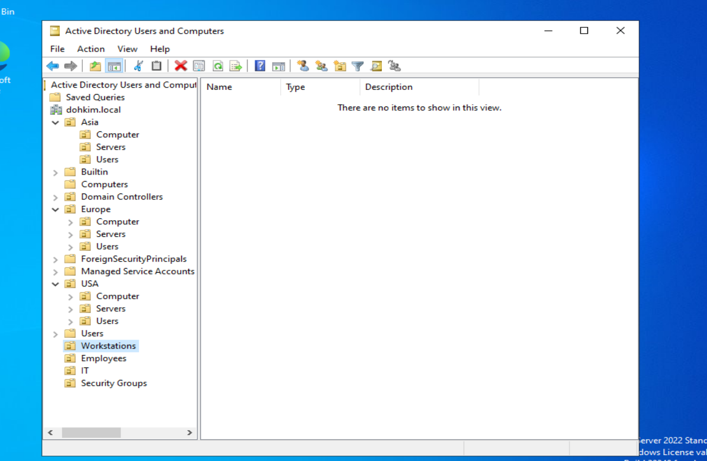
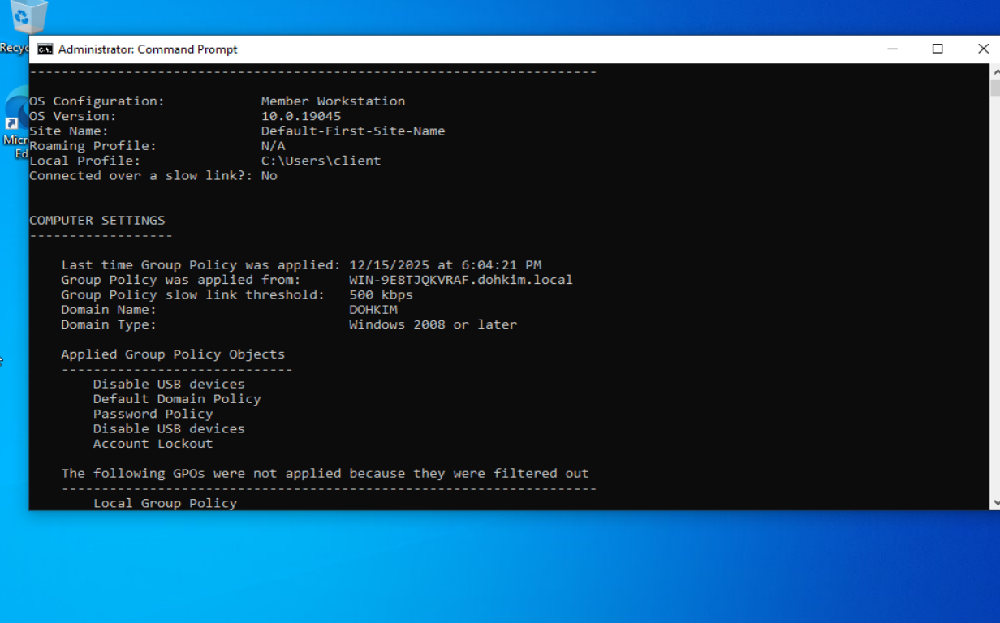

# Project Report: Active Directory & GPO Security Lab

Author: Doh Kim
Date: 2025-12-17

**Domain:** `dohkim.local`  
**Environment:** Windows Server 2019/2022 (Domain Controller) & Windows 10 Pro (Client)

---

## 1. Lab Overview

This project documents the end-to-end deployment of a Microsoft Active Directory environment designed to simulate a global enterprise network. The lab focuses on identity management, geographic Organizational Unit (OU) design, and automated security enforcement using Group Policy Objects (GPOs). Emphasis is placed on real-world troubleshooting rather than a flawless setup, reflecting scenarios commonly encountered in production environments.

---

## 2. Infrastructure & Installation

### 2.1 Domain Controller Configuration

* **Hostname:** `win-9e8tjqkvraf`
* **Domain:** `dohkim.local`
* **Static IP:** `192.168.1.10`
* **Roles Installed:**

  * Active Directory Domain Services (AD DS)
  * DNS Server
* **Network Type:** Host-only

AD DS installation included DNS integration and forest creation. The server was promoted to a Domain Controller and rebooted to complete setup.

---

### 2.2 Windows 10 Pro Client Installation (Troubleshooting)

Installing Windows 10 Pro in a virtualized environment needed many workarounds.

#### ISO & Edition Selection

* The ISO from Microsoft Media Creation Tool was not giving me an option to install windows 10 pro, instead was installing windows 10 directly
* **Solution:**

  * Created an `ei.cfg` file to force Windows 10 Pro edition
  * Used **ImgBurn** to rebuild the ISO with the modified configuration

#### Partition & Install Loop Issues

* VM kept restarting mid-install, resulting in duplicate disk partitions
* Windows setup repeatedly looped back to the installer

**Resolution:**

* Selected **Custom Install**
* Deleted unnecessary partitions
* Installed to the primary 50GB partition
* Removed the ISO from the VM after first reboot

#### OOBE & Account Setup

* Bypassed Microsoft account requirement during OOBE
* Disabled virtual network adapter temporarily
* Completed setup using an **offline local account**

---

## 3. Networking & Domain Join Troubleshooting

### Initial Issues Encountered

* Client unable to locate domain
* Duplicate IP address assignment between client and server
* DNS resolution failures

### Root Cause

* Incorrect VirtualBox network adapter configuration
* Client DNS not pointing to the Domain Controller
* Had fixed IPv4 setup in the Domain Controller VM which I had forgotten about 

### Resolution Steps

* Confirmed both VMs were using the same **Host-only adapter**
* Assigned:

  * **DC:** Static IP (`192.168.1.10`)
  * **Client:** Static IP (`192.168.1.50`)
* Manually set client IPv4 DNS to DC IP

### Verification Commands

```bash
ping 192.168.1.10
nslookup dohkim.local
```

---

## 4. Domain Join & Authentication Fixes

1. Joined client to `dohkim.local`
2. Rebooted system
3. Successfully logged in with domain credentials

### Authentication Issue Resolved

* Encountered "wrong password" error during login
* **Fix:** Used correct login format:

```
DOHKIM\\Administrator
```

This forced authentication against the Domain Controller instead of the local machine.

---

## 5. Organizational Unit (OU) Design

A geographic OU hierarchy was implemented to support scalable policy management.

```
dohkim.local
├── Asia
│   ├── Computers
│   ├── Servers
│   └── Users
├── USA
│   ├── Computers
│   ├── Servers
│   └── Users
├── Europe
│   ├── Computers
│   ├── Servers
│   └── Users
├── IT
└── Security Groups
```

* Client computer moved from default **Computers** container to `USA → Computers`

---

## 6. Group Policy Implementation & Validation

### GPO Summary

| Policy Name       | Target    | Validation Method       | Result                         |
| ----------------- | --------- | ----------------------- | ------------------------------ |
| Password Policy   | Domain    | Attempted weak password | Rejected (complexity enforced) |
| Account Lockout   | Domain    | 3 failed logins         | Account locked successfully    |
| Drive Mapping     | Users     | Checked *This PC*       | Z: drive auto-mounted          |
| Desktop Wallpaper | Users     | Visual check / settings | Forced; settings greyed out    |
| Removable Storage | Computers | Mounted ISO/USB         | Access denied                  |


---

## 7. GPO Validation & Reporting

### gpresult Visibility Issue

* `gpresult /r` initially returned **Applied Group Policy Objects: N/A**

**Resolution:**

* Ran Command Prompt as Administrator

The report confirmed both user and computer policies were successfully applied.

---

## 8. Critical Troubleshooting Log

### 8.1 Account Lockout Showing "Never"

**Problem:**

```
net accounts
Lockout threshold: Never
```

**Root Cause:**

* Password and lockout policies must be linked at the **Default Domain Policy** level

**Fix:**

* Moved lockout settings to Default Domain Policy
* Ran `gpupdate /force`
* Rebooted client

**Result:** Lockout threshold correctly updated to 3 attempts

---

### 8.2 Drive Mapping Permission Denied

**Problem:**

* Drive mapped successfully, but file writes failed

**Root Cause:**

* NTFS permissions on server share did not allow write access

**Fix:**

* Granted **Domain Users** Modify permissions on `LabShare`

**Result:** Users could read/write successfully

---

## 9. Lab Artifacts

* `screenshots/`







---

## 10. Technical Skills Demonstrated

* **Identity Management:** Active Directory Domain Services (AD DS)
* **Network Services:** DNS configuration and troubleshooting
* **Security Baselines:** Group Policy Management (GPMC)
* **Access Control:** Password and account lockout enforcement
* **Data Loss Prevention:** Removable storage restrictions
* **System Administration:** gpresult, net accounts, nslookup

---

## 11. Conclusion

This lab demonstrates a production-style Active Directory deployment with emphasis on troubleshooting and validation. The project highlights practical skills in Windows Server administration, enterprise policy enforcement, and systematic problem resolution, making it directly applicable to real-world IT and cybersecurity roles.
