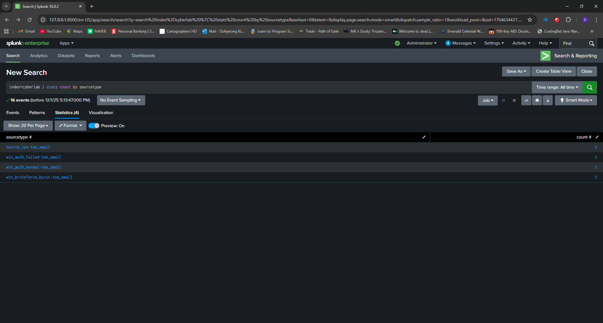

# Splunk SIEM Log Analysis & Detection Engineering Lab

Author: Doh Kim
Date: 2025-12-02
Dataset:

- win_auth_normal.log
- win_auth_failed.log
- win_bruteforce_burst.log
- source_ips.log

--- 

## 1. Overview

This project demonstrates the process of building a miniature SIEM workflow inside Splunk, including log ingestion, search query development, threat hunting, dashboard creation, and detection engineering.
The dataset consists of manually curated authentication logs and network-based indicators meant to simulate a small enterprise environment experiencing normal login activity, failed login attempts, and a brute-force attack burst.

---

## 2. Objectives

- Ingest multiple log types into Splunk under a dedicated index
- Create structured searches for authentication monitoring
- Detect brute-force activity using SPL and correlation logic
- Enrich network data using iplocation
- Build dashboards for SOC-style visibility
- Configure alerts for repeated failed logins and brute-force success patterns
- Document each step with screenshots and saved artifacts

---

## 3. Tools Used

- Splunk Enterprise
- Custom log dataset (Windows auth + IP addresses)
- SPL (Search Processing Language)
- Geo-IP lookup (iplocation)
- Splunk Dashboard Studio

---

## 4. Log Ingestion

### 4.1 Uploading the Dataset

All four log files were uploaded into Splunk using **Add Data → Upload**:

- `win_auth_normal.log`  
- `win_auth_failed.log`  
- `win_bruteforce_burst.log`  
- `source_ips.log`  

Each file was added to a custom index:

- **Index:** `cyberlab`

Splunk automatically assigned the sourcetypes with a `-too_small` suffix due to the small dataset size:

- `win_auth_normal-too_small`  
- `win_auth_failed-too_small`  
- `win_bruteforce_burst-too_small`  
- `source_ips-too_small`  

Verification search:
  - `index=cyberlab | stats count by sourcetype`

This confirmed all datasets were successfully ingested.

---

## 5. Threat Hunting & Search Queries

### 5.1 Normal Authentication Activity

This search produces a breakdown of successful logins, grouped by user and host:
 - `index=cyberlab sourcetype="win_auth_normal-too_small" | stats count by user, host`

 

---

### 5.2 Failed Authentication Attempts

Failed login attempts were analyzed to identify potential misuse or weak passwords:
 - `index=cyberlab sourcetype="win_auth_failed-too_small" | stats count by user, host`

---

### 5.3 Brute-Force Burst Detection

The brute-force dataset simulates multiple failed attempts followed by a successful login.  
A `transaction` search correlates events by user and host within a 30-second window:

 - `index=cyberlab sourcetype="win_bruteforce_burst-too_small" | transaction user host maxspan=30s | where eventcount > 3`

 This highlights a failed-login burst followed by a success, matching common brute-force patterns.

---

### 5.4 Source IP Geo-Enrichment

Using `iplocation`, IP addresses were enriched with geographic metadata for basic network threat hunting:
 - `index=cyberlab sourcetype="source_ips-too_small" | iplocation IP | stats count by IP, Country`

---

## 6. Dashboard Creation

A SOC-style dashboard was created containing four panels:

 1. **Normal Authentication Over Time**
 - `index=cyberlab sourcetype="win_auth_normal-too_small"| timechart count by user`

 2. **Failed Authentication Attempts**

 - `index=cyberlab sourcetype="win_auth_failed-too_small" | timechart count by user`

 3. **Brute-Force Indicators**

 - `index=cyberlab sourcetype="win_bruteforce_burst-too_small" | stats count by user, host`

 4. **Top Source IPs by Count (Geo-Enriched)**
 - `index=cyberlab sourcetype="source_ips-too_small" | iplocation IP | top limit=10 IP`

---

## 7. Detection Engineering (Alerts)

Two alerts were configured to demonstrate automated security monitoring logic.

### 7.1 Alert: Brute-Force Login Detected

**Search:**
 - `index=cyberlab sourcetype="win_bruteforce_burst-too_small"| transaction user host maxspan=30s| where eventcount > 3`
- **Trigger:** `eventcount > 3`  
- **Schedule:** Every 1 hour  
- **Action:** Log to Splunk + optional email notification  

---

### 7.2 Alert: Excessive Failed Logins

**Search:**
 - `index=cyberlab sourcetype="win_auth_failed-too_small"| stats count by user| where count > 5`

- **Trigger:** `count > 5`  
- **Schedule:** Every 1 hour  

---

## 8. Conclusion

This lab demonstrates how to build a fully functioning miniature SIEM pipeline:

- Ingesting multiple log formats into a dedicated Splunk index  
- Developing SPL searches for authentication monitoring  
- Detecting brute-force patterns using correlation logic  
- Leveraging Geo-IP enrichment for network analysis  
- Creating dashboards for SOC-style visibility  
- Implementing real-time alerts for suspicious activity  

The result is a realistic representation of what a SOC analyst or detection engineer would build when monitoring user authentication activity across an enterprise environment.

---

## Disclaimer

All logs were custom-generated for educational use and ingested on a personal Splunk deployment.  
No real systems, networks, or identities were accessed.
