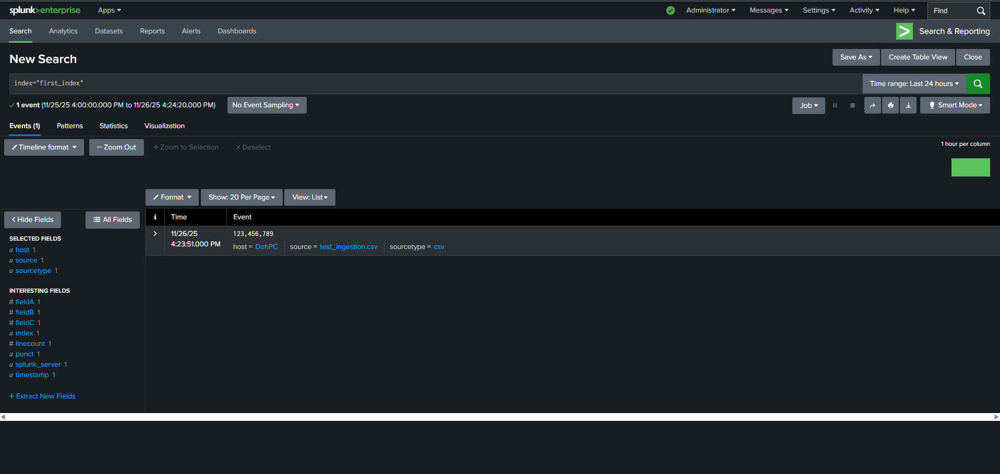
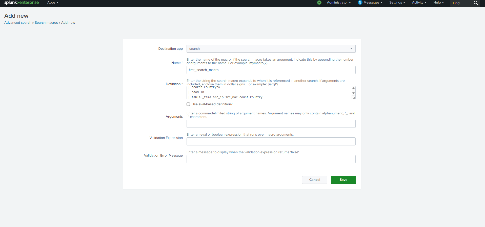
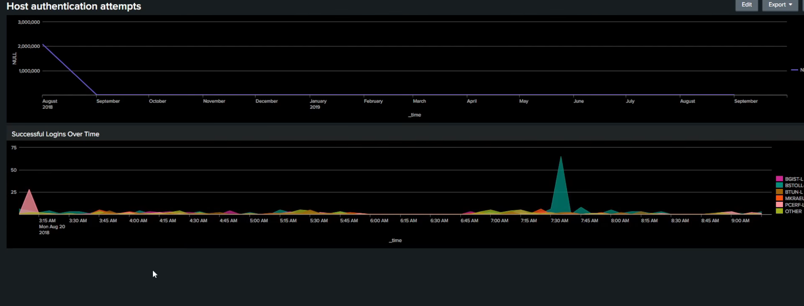

# Splunk SIEM Lab

This project focuses on building hands-on experience with Splunk: ingesting security logs, creating advanced correlation searches, building interactive dashboards, and configuring detection alerts. The goal was to simulate real SOC analyst workflows using a highly realistic, open-source dataset.

---

## What I Learned
* Ingested BOTS v3 log types, including **Windows Event Logs (`4624/4625`)**, **AWS CloudTrail**, and **Web Traffic** logs.
* Built correlation searches using the **`transaction`** command to link successful and failed authentication events.
* Created dynamic, token-based dashboards for monitoring authentication activity and suspicious network source IPs.
* Configured specific security alerts for Brute-Force Detection and Mass File Encryption (Ransomware simulation).
* Used advanced SPL (Search Processing Language) for data enrichment with commands like **`iplocation`** and **`timechart`**.

---

## Search Examples
* **Authentication Correlation (Brute-Force)**:
    `index=botsv3 sourcetype="WinEventLog:Security" (EventCode=4624 OR EventCode=4625) | transaction host, AccountName maxspan=30m`
* **Suspicious Network Traffic (Geo-IP & Top Talkers)**:
    `index=botsv3 sourcetype=stream:ip | iplocation Source_IP | stats count by Source_IP, country`
* **Ransomware File Modification Detection**:
    `index=botsv3 sourcetype=filemodifications | stats count by file_path, user | where count > 50`

---
## Examples

- First index 

- Search Macro 

- Dashboard of Host authentication attempts and Succenssful logins over time

---

## Next Steps
* Integrate the BOTS AD logs (DC logs) to build more comprehensive user activity baselines.
* Build a **Security Incident Dashboard** for monitoring the health of all configured alerts and key security metrics.
* Try creating a correlation search to track a user's activity across multiple log types (e.g., login, web activity, and file modification) using the **`join`** command.