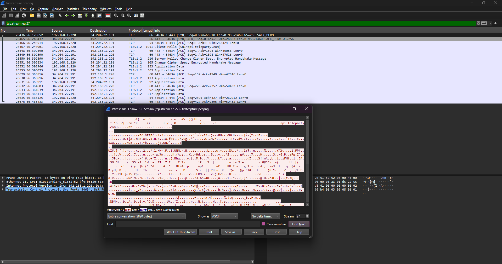
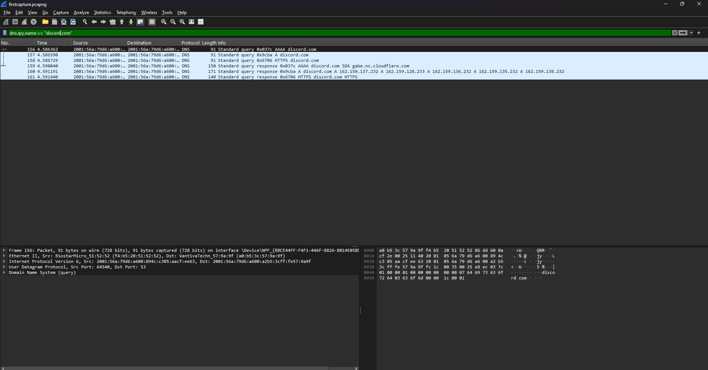

# Wireshark Packet Analysis

Author: Your Name  
Date: 2025-11-24  

This project highlights my hands-on practice with Wireshark, focusing on capturing and analyzing network traffic in a controlled lab environment. The goal was to learn how to navigate the interface, apply filters, understand traffic patterns, and use built-in analysis tools.

---

## Skills Practiced

- Navigated the Wireshark interface (packet list, details, and bytes panes) and customized the layout for readability.  
- Captured live traffic on different network interfaces and saved captures for later analysis.  
- Applied display filters such as `http`, `dns`, and `tcp.flags.syn == 1` to focus on specific protocols and events.  
- Used colorization rules to visually highlight important packets (e.g., TCP handshakes, errors) for faster triage.  
- Created custom profiles with preferred columns, filters, and color rules to streamline workflow.  
- Explored the Statistics menu, including Protocol Hierarchy, Conversations, Endpoints, and IO Graphs to summarize traffic patterns.

---

## Example Analyses

- Identified TCP 3‑way handshakes in captured traffic and confirmed source/destination ports, sequence numbers, and flags.  

- Traced DNS request/response flows to see which domains were queried and which IP addresses were returned.  

---

## Takeaways

- Gained confidence reading packet‑level details (headers, flags, and payloads) instead of relying only on high‑level tools.  
- Learned how filters and statistics views can turn noisy captures into focused, answerable questions about network behavior.

---

## Planned Next Steps

- Analyze TLS handshakes to understand certificate exchange and encryption setup.  
- Build a small lab to capture and detect ARP spoofing traffic.  
- Capture and review basic malware or C2‑like traffic in an isolated environment.  
- Use IO Graphs to visualize latency, throughput, and burst patterns during simulated attacks or load tests.

